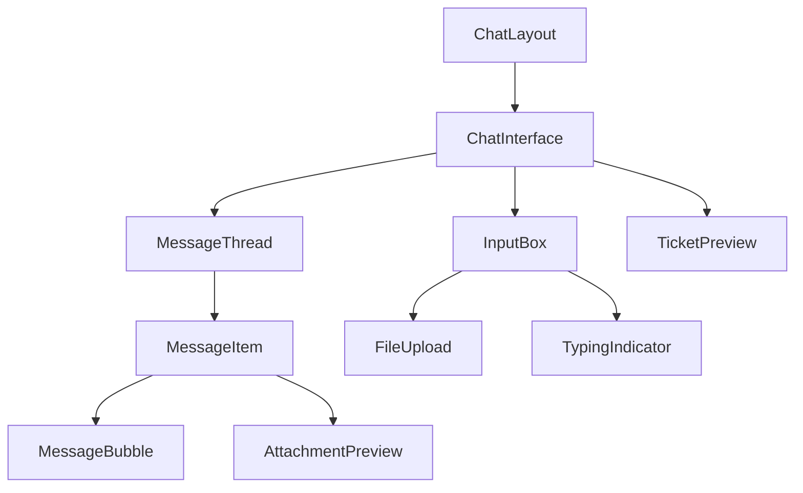

# Component Structure

## Overview
This document outlines the component hierarchy and organization for the AI Chat Ticket System.

## Directory Structure

```
app/
├── tenant/
│   ├── chat/
│   │   ├── _components/
│   │   │   ├── chat-interface.tsx
│   │   │   ├── message-thread.tsx
│   │   │   ├── message-item.tsx
│   │   │   ├── input-box.tsx
│   │   │   ├── file-upload.tsx
│   │   │   ├── typing-indicator.tsx
│   │   │   └── ticket-preview.tsx
│   │   ├── layout.tsx
│   │   └── page.tsx
│   └── tickets/
│       └── [ticketId]/
│           ├── _components/
│           │   └── chat-history.tsx
│           ├── layout.tsx
│           └── page.tsx
└── staff/
    └── tickets/
        └── [ticketId]/
            ├── _components/
            │   └── chat-history.tsx
            ├── layout.tsx
            └── page.tsx

components/
├── ui/
│   ├── chat/
│   │   ├── message-bubble.tsx
│   │   ├── attachment-preview.tsx
│   │   └── quick-actions.tsx
│   └── shared/
│       ├── loading-spinner.tsx
│       ├── error-message.tsx
│       └── file-preview.tsx
└── providers/
    └── chat-provider.tsx
```

## Component Hierarchy



## Component Specifications

### Page Components

#### ChatPage
```typescript
// app/tenant/chat/page.tsx
"use server"

export default async function ChatPage() {
  return (
    <ChatInterface />
  )
}
```

### Layout Components

#### ChatLayout
```typescript
// app/tenant/chat/layout.tsx
"use server"

export default async function ChatLayout({
  children
}: {
  children: React.ReactNode
}) {
  return (
    <div className="flex h-screen">
      <div className="flex-1 flex flex-col">
        {children}
      </div>
    </div>
  )
}
```

### Feature Components

#### ChatInterface
```typescript
// app/tenant/chat/_components/chat-interface.tsx
"use client"

interface ChatInterfaceProps {
  initialMessages?: Message[]
}

export function ChatInterface({ initialMessages = [] }: ChatInterfaceProps) {
  return (
    <div className="flex flex-col h-full">
      <MessageThread messages={messages} />
      <InputBox onSend={handleSend} />
    </div>
  )
}
```

#### MessageThread
```typescript
// app/tenant/chat/_components/message-thread.tsx
"use client"

interface MessageThreadProps {
  messages: Message[]
}

export function MessageThread({ messages }: MessageThreadProps) {
  return (
    <div className="flex-1 overflow-y-auto">
      {messages.map((message) => (
        <MessageItem key={message.id} message={message} />
      ))}
    </div>
  )
}
```

### UI Components

#### MessageBubble
```typescript
// components/ui/chat/message-bubble.tsx
interface MessageBubbleProps {
  content: string
  role: 'user' | 'assistant'
}

export function MessageBubble({ content, role }: MessageBubbleProps) {
  return (
    <div className={cn('px-4 py-2 rounded-lg', {
      'bg-primary text-white ml-auto': role === 'user',
      'bg-muted': role === 'assistant'
    })}>
      {content}
    </div>
  )
}
```

## Component State Management

### Chat Provider
```typescript
// components/providers/chat-provider.tsx
"use client"

interface ChatContextType {
  messages: Message[]
  isTyping: boolean
  sendMessage: (content: string) => Promise<void>
  uploadFile: (file: File) => Promise<void>
}

export const ChatContext = createContext<ChatContextType>({} as ChatContextType)

export function ChatProvider({ children }: { children: React.ReactNode }) {
  // Implementation
}
```

## Shared Types

```typescript
// types/chat-types.ts
export interface Message {
  id: string
  content: string
  role: 'user' | 'assistant'
  attachments?: Attachment[]
  createdAt: string
}

export interface Attachment {
  id: string
  fileUrl: string
  fileName: string
  fileType: string
}
```

## Component Guidelines

### Server Components
- Use "use server" directive
- Handle data fetching
- Pass data as props to client components
- Implement Suspense boundaries

### Client Components
- Use "use client" directive
- Handle user interactions
- Manage local state
- Use hooks for shared logic

### Performance Considerations
- Implement virtualization for long lists
- Lazy load images and attachments
- Use proper memo and callback hooks
- Optimize re-renders

### Accessibility
- Use proper ARIA labels
- Implement keyboard navigation
- Maintain focus management
- Support screen readers

### Error Handling
- Implement error boundaries
- Show meaningful error messages
- Provide retry mechanisms
- Handle edge cases

### Loading States
- Show loading indicators
- Implement skeleton screens
- Handle partial loading
- Prevent layout shifts 