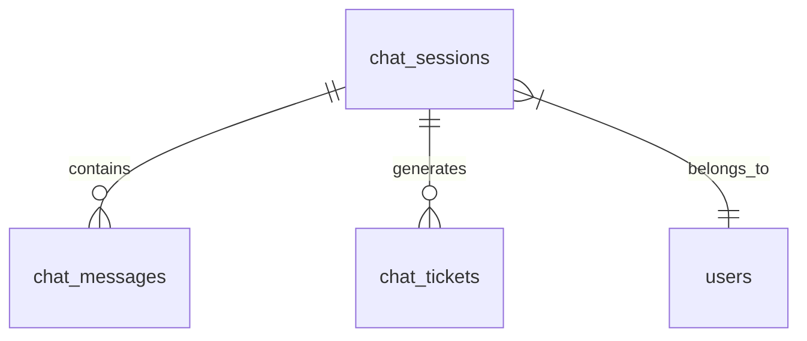
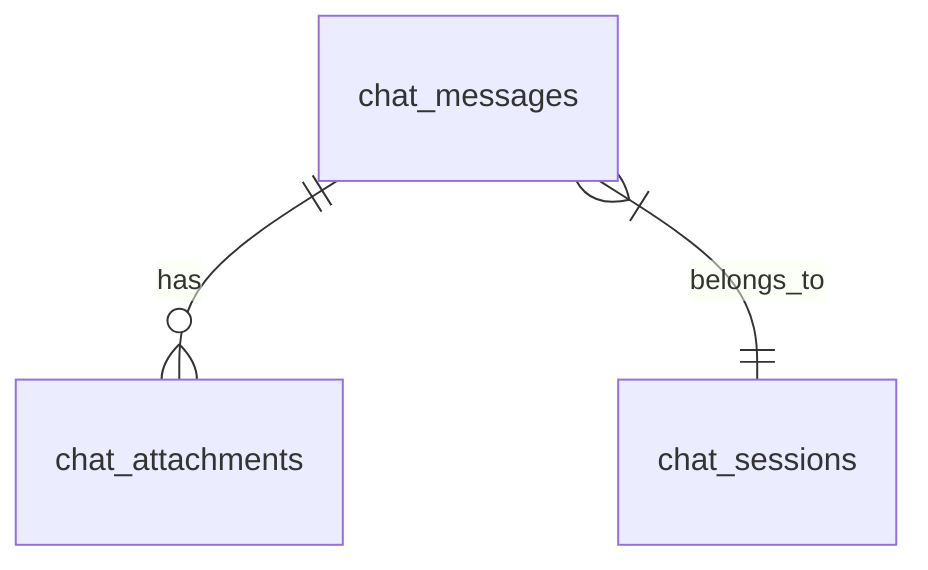
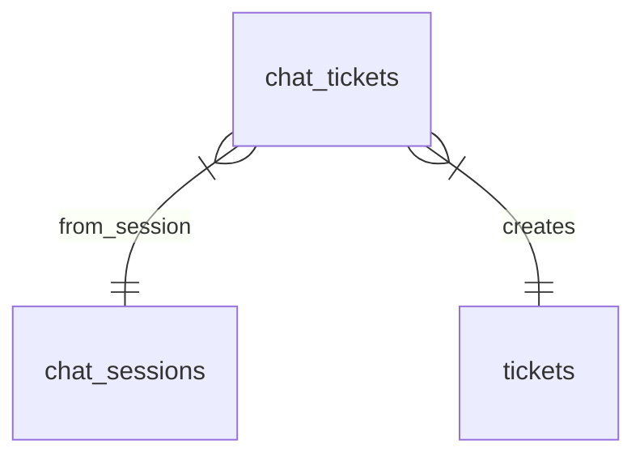

# Database Relationships

## Overview
This document details the relationships between different tables in the AI Chat Ticket System database.

## Core Relationships

### Chat Session Relationships


### Message Relationships


### Ticket Relationships


## Detailed Relationships

### chat_sessions
- Has many `chat_messages`
- Has many `chat_tickets`
- Belongs to one `user` (tenant)

### chat_messages
- Belongs to one `chat_session`
- Has many `chat_attachments`
- Contains metadata for AI processing

### chat_attachments
- Belongs to one `chat_message`
- Stores file information

### chat_tickets
- Belongs to one `chat_session`
- Belongs to one `ticket`
- Links chat conversations to tickets

## Cascade Behaviors

### Delete Cascades
1. When a `chat_session` is deleted:
   - All associated `chat_messages` are deleted
   - All associated `chat_tickets` are deleted
   - All associated `chat_attachments` are deleted

2. When a `chat_message` is deleted:
   - All associated `chat_attachments` are deleted

### Update Cascades
- No update cascades implemented
- All updates must be handled explicitly

## Constraints

### Foreign Key Constraints
```sql
-- chat_messages
ALTER TABLE chat_messages
ADD CONSTRAINT fk_chat_messages_session
FOREIGN KEY (session_id)
REFERENCES chat_sessions(id)
ON DELETE CASCADE;

-- chat_attachments
ALTER TABLE chat_attachments
ADD CONSTRAINT fk_chat_attachments_message
FOREIGN KEY (message_id)
REFERENCES chat_messages(id)
ON DELETE CASCADE;

-- chat_tickets
ALTER TABLE chat_tickets
ADD CONSTRAINT fk_chat_tickets_session
FOREIGN KEY (session_id)
REFERENCES chat_sessions(id)
ON DELETE CASCADE;

ALTER TABLE chat_tickets
ADD CONSTRAINT fk_chat_tickets_ticket
FOREIGN KEY (ticket_id)
REFERENCES tickets(id);
```

## Data Integrity Rules

### chat_sessions
- Must have a valid tenant_id
- Status must be one of: active, resolved, archived
- Cannot be deleted if has active tickets

### chat_messages
- Must belong to a valid chat_session
- Must have content and role
- Role must be either 'user' or 'assistant'

### chat_attachments
- Must belong to a valid chat_message
- Must have valid file information
- File URL must be accessible

### chat_tickets
- Must reference valid chat_session and ticket
- Cannot be duplicated (one ticket per session)
- Cannot be created for archived sessions

## Query Optimization

### Common Queries
1. Get all messages for a session:
```sql
SELECT * FROM chat_messages
WHERE session_id = :session_id
ORDER BY created_at ASC;
```

2. Get session with messages and attachments:
```sql
SELECT 
  cs.*,
  cm.*,
  ca.*
FROM chat_sessions cs
LEFT JOIN chat_messages cm ON cs.id = cm.session_id
LEFT JOIN chat_attachments ca ON cm.id = ca.message_id
WHERE cs.id = :session_id;
```

3. Get tickets from chat:
```sql
SELECT 
  ct.*,
  t.*
FROM chat_tickets ct
JOIN tickets t ON ct.ticket_id = t.id
WHERE ct.session_id = :session_id;
```

### Indexes Used
- `idx_chat_sessions_tenant`
- `idx_chat_messages_session`
- `idx_chat_attachments_message`
- `idx_chat_tickets_session`
- `idx_chat_tickets_ticket` 